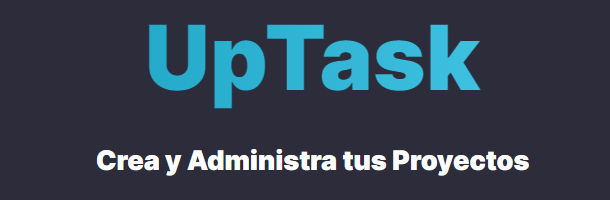
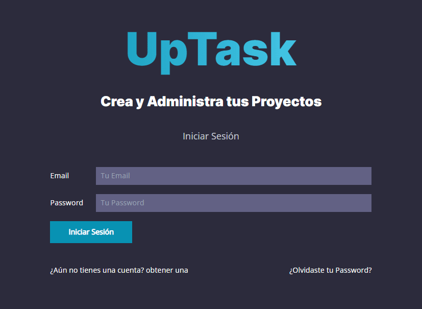
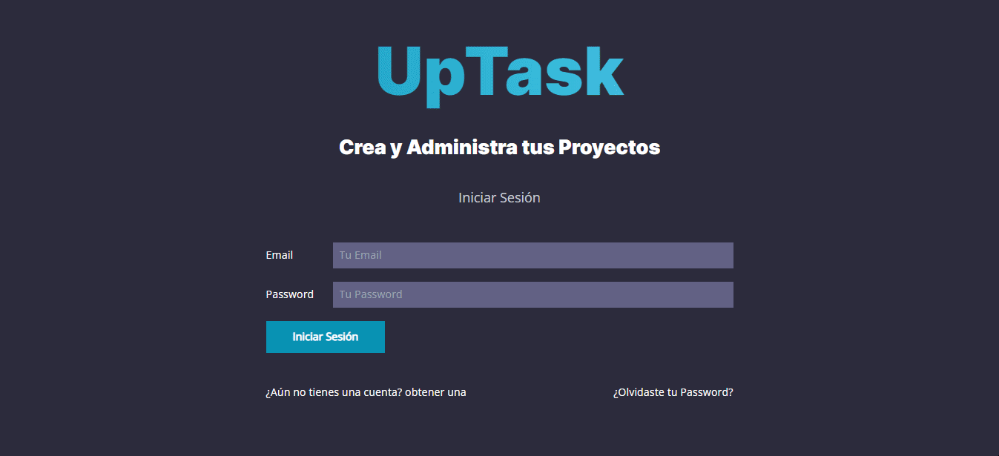

<h1 align="center">Welcome to UpTask :sparkles:</h1>

This project works as a web application to help people to create tasks for their projects and in this way to have an organization over these by classifying them in completed and pending. It has a registry of users, projects and tasks which will be stored in a database. The project is quite simple and is inspired by Asana and Trello.

The project was built with the MVC structure, mostly with PHP language, JavaScript was also used for small functionalities and also to build an API to query the database through Fetch API. The MySQL database consists of different tables to store data such as: the registration of those who will use the web app (mail, personal information), projects, tasks.

## Registration views :house:

It is the part that every user sees when entering the application, here you can perform different actions, for example, if you have an account you can log in, if you have an account and do not remember the password you can recover it through the mail and in case you do not have an account you can create one to enter the application.

all these actions have their own form and due validations. As I mentioned, there is the possibility to recover a password or verify the account when creating a new account, for this I used PHPMailer to test the correct operation of these actions.

## Simulation of a new registration :feet:

Here I show you how a person interested in using this application could register, the steps needed and the way it should be done, as you can see in the gif the process is quite simple and has much in common with the process that many applications have today. Each form for registration is validated so that you enter the information required by the application, the same will be used to customize the application with the information given, this will be seen in the next section. 

## Internal view of the application 	:mag_right:

Once the account is created, the user has this view, from here he has a dashboard where he can view all the projects created, on the left side there is a menu with options to create projects, view his profile and view the projects. In the profile view you can change your password if you want to do so.

From the "projects" view you can click on any of the created projects to start adding tasks related to this project or show the ones that have already been created, from here you can classify them as completed or pending, by double clicking on any task you can change its status and you can also delete them, all this is controlled with PHP and the database. For the alerts of the change of status of the tasks we used <a href="https://sweetalert2.github.io/" target="_blank">SweetAlert</a> for a better user experience.

## Responsive :balloon:

It is worth mentioning that the project is fully responsive for phones 480px, tablets 768px, computers 1024px.

## Author :black_nib:
This project is part of the course "Desarrollo web Completo" whose the instructor is Juan de la Torre, you can see his page <a href="https://codigoconjuan.com/" target="_blank">here</a>:arrow_forward:.

:octocat: **Randy Urriola**
- Portfolio: <a href="https://randy-urriola.github.io/Portfolio/" target="_blank">/randy-urriola</a>
- GitHub: <a href="https://github.com/randy-urriola" target="_blank">@randy-urriola</a>
- LinkedIn: <a href="https://www.linkedin.com/in/randy-urriola/" target="_blank">@randy-urriola</a>

## 💻 Programming Lenguages and Tools used:

<code></code>&nbsp;&nbsp;
<code></code>&nbsp;&nbsp;
<code></code>&nbsp;&nbsp;
<code></code>&nbsp;&nbsp;
<code></code>&nbsp;&nbsp;
<code></code>&nbsp;&nbsp;
<code></code>&nbsp;&nbsp;
<code></code>&nbsp;&nbsp;
